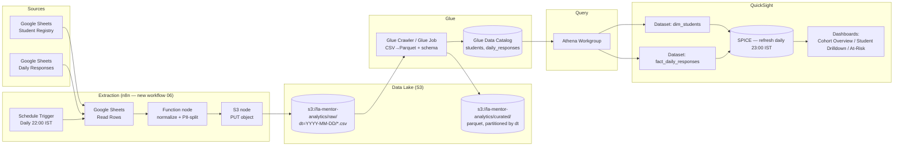

# QuickSight Mentor Dashboard — Data Architecture

## 1. Purpose

BOT_RAG_NOTIFY today stops at Google Sheets: every check-in lands in a row, and
mentors read the sheet by hand. This document designs the next layer — an
**Amazon QuickSight dashboard** that gives mentors (and eventually LA
Excellence management) a live, visual view of student accountability, sourced
from Google Sheets today and extensible to other systems (n8n execution logs,
the bot's own delivery/engagement stats, and — per the PRD's Phase 6 — the
future LA Mentora App database) without redesigning the pipeline each time a
source is added.

This is additive: it does not change any existing n8n workflow, Telegram bot
behavior, or the Google Sheet schema described in `README.md`. It only adds a
read path from those sources into QuickSight.

## 2. Data source inventory

| Source | System of record for | Access method | Update cadence | Contains PII |
|---|---|---|---|---|
| `Student Registry` tab | Student roster, batch, optional subject | Google Sheets API | Manual, low frequency | Yes (name, phone) |
| `Daily Responses` tab | Morning/evening check-in answers | Google Sheets API | 3x/day (7 AM, 2 PM, 9:30 PM writes) | Yes (name) |
| n8n execution log (workflows 01–05) | Delivery success/failure, retries, webhook errors | n8n REST API / DB | Continuous | No |
| Telegram Bot API | Message delivery status, `/start` onboarding events | Telegram `getUpdates`/webhook payloads (already flowing through workflow 04) | Continuous | Chat ID only |
| *(future)* LA Mentora App DB | Post-migration system of record (PRD Phase 6) | RDS/Postgres export | TBD | Yes |

Only the two Google Sheets tabs are load-bearing for v1 of the dashboard. The
n8n execution log and Telegram delivery events are optional "operational
health" sources added in a later phase (Section 8) — the pipeline is designed
so adding them is a new extractor, not a new architecture.

## 3. Why not connect QuickSight directly to Google Sheets

QuickSight has no native Google Sheets connector, and Sheets' own API is not
one of QuickSight's supported data sources (Athena, Redshift, RDS/Aurora, S3,
Snowflake, BigQuery, and a handful of SaaS connectors). Two viable paths
exist:

| Option | How | Verdict |
|---|---|---|
| **A. S3 + Athena** | Export Sheets rows to S3 as Parquet/CSV, catalog with Glue, query via Athena, connect QuickSight to Athena | **Recommended.** Serverless, cheap, keeps the whole pipeline in AWS, easy to add new sources later as new S3 prefixes/tables. |
| B. Google BigQuery | Sync Sheets → BigQuery (Connected Sheets), connect QuickSight to BigQuery directly | Viable if the org standardizes on GCP for analytics, but adds a second cloud and a second billing/IAM surface for a project that is otherwise AWS-free today. Not recommended here. |

The rest of this document details Option A.

## 4. Target architecture



**Why n8n as the extractor:** n8n already holds live, authorized Google
Sheets OAuth credentials and runs on a schedule — reusing it avoids standing
up a second Google API integration (a Lambda with its own service-account
key) just for analytics. It only needs one new node type: an S3 write (HTTP
Request node with SigV4 auth, or the community S3 node) and an IAM user/role
scoped to `s3:PutObject` on a single prefix.

## 5. Ingestion workflow (new: `06_export_to_datalake.json`)

Runs once daily, after the evening check-in window closes (22:00 IST — after
`03_night_checkin`, before `05_weekly_summary` on Sundays):

1. **Schedule Trigger** — 22:00 IST daily.
2. **Google Sheets → Read Rows** — `Student Registry` tab (full snapshot; it's small and slow-changing).
3. **Google Sheets → Read Rows** — `Daily Responses` tab, filtered to `Date = today` (avoid re-exporting history every run).
4. **Function node** — normalize: parse `callback_data`-derived codes (`hours_lt4`, `prod_3`, etc. — see `README.md` mapping table) into typed columns, cast `Date`/`Timestamp`, and split PII: student name stays keyed only by a surrogate `student_id`; phone numbers are dropped from the analytics record entirely (dashboard needs names for mentor readability, not phone numbers).
5. **S3 node** — write two objects per run:
   - `raw/students/dt=<today>/students.csv`
   - `raw/daily_responses/dt=<today>/responses.csv`
6. **Error branch** — on any node failure, reuse the existing Telegram-alert pattern already in this repo (send a message to the mentor's own chat ID) so a broken export doesn't fail silently for days.

Idempotency: partitioning by `dt=` and re-running only overwrites that day's
object, so a manual re-run or backfill is safe.

## 6. Storage & schema layer

**S3 layout:**
```
s3://la-mentor-analytics/
  raw/students/dt=YYYY-MM-DD/students.csv
  raw/daily_responses/dt=YYYY-MM-DD/responses.csv
  curated/dim_students/                 (Parquet, latest snapshot)
  curated/fact_daily_responses/dt=.../  (Parquet, partitioned)
```

A daily **Glue job** (Python shell, ~5 lines using `awswrangler`) reads the
day's `raw/` CSVs, applies the curated schema below, and writes Parquet into
`curated/`. A **Glue Crawler** (or a Terraform/CDK-defined static table)
keeps the Data Catalog schema in sync.

**Curated schema — `dim_students`:**

| Column | Type | Source |
|---|---|---|
| `student_id` | string (surrogate key, hash of chat_id) | derived |
| `student_name` | string | Student Registry |
| `batch_group` | string | Student Registry |
| `start_date` | date | Student Registry |
| `optional_subject` | string | Student Registry |

**Curated schema — `fact_daily_responses`:**

| Column | Type | Source |
|---|---|---|
| `student_id` | string | derived (join key) |
| `response_date` | date | `Date` |
| `morning_target_set` | boolean | derived (was `Morning Target` non-empty) |
| `planned_hours` | decimal | `Planned Hours` |
| `evening_status` | string enum | `Evening Status` |
| `hours_completed_band` | string enum | `Hours Completed` |
| `hours_completed_numeric` | decimal | derived midpoint (e.g. `hours_4to6` → 5.0) for averaging |
| `subjects_covered` | string enum | `Subjects Covered` |
| `test_written` | boolean | `Test Written Today?` |
| `productivity_score` | int (1–5) | `Productivity (1-5)` |
| `has_blocker_note` | boolean | derived (was `Blockers/Notes` non-empty) |
| `reported_at` | timestamp | `Timestamp` |

Phone numbers are never written to `curated/` — they exist only in the
source Google Sheet, which stays the system of record for that field.

## 7. QuickSight layer

- **Data source:** Athena, workgroup `la-mentor-analytics`, output location a
  separate `s3://la-mentor-analytics/athena-results/` prefix.
- **Datasets:** `dim_students` and `fact_daily_responses` imported to
  **SPICE** (not direct query) — dataset is small (≤ a few hundred rows/day
  even at 80 students × 365 days) and SPICE keeps the dashboard fast and
  Athena costs near zero.
- **Refresh schedule:** daily at 23:00 IST, one hour after the extraction
  workflow runs, so each night's data is visible by the next morning.
- **Calculated fields** (built in QuickSight on top of the fact table):
  - `completion_rate` = `countIf(evening_status = 'status_full') / count(response_date)` per student per week
  - `reporting_streak` = consecutive days with a row present (window function over `response_date`)
  - `hours_variance` = `hours_completed_numeric - planned_hours`
  - `at_risk_flag` = `reporting_streak = 0 for ≥ 3 days` OR `avg(productivity_score) < 2` over trailing 7 days (mirrors the PRD's Phase 3 "3 consecutive missed days" escalation rule)

## 8. Dashboard design

| Page | Audience | Key visuals |
|---|---|---|
| **Cohort Overview** | Mentor / management | KPI tiles (today's response rate, avg hours, avg productivity), trend line of daily completion rate, batch-vs-batch comparison bar |
| **Student Drilldown** | Mentor, 1:1 review | Filter control by `student_name`; hours-vs-plan line over time; productivity heatmap by day; blocker notes table |
| **At-Risk / Intervention** | Mentor | Table filtered to `at_risk_flag = true`, sorted by streak length, with last-contacted note |
| **Operational Health** *(Phase 2, once n8n log + Telegram delivery data is added, per Section 2)* | Whoever runs the automation | Message delivery success rate, webhook error count, onboarding funnel (`/start` events vs. registry size) |

Row-level security is not needed for a single-mentor v1. If LA Excellence
adds multiple mentors per batch (multi-tenant), add a QuickSight RLS dataset
keyed on `batch_group` before exposing dashboards beyond one owner.

## 9. Security & governance

- S3 bucket: block all public access, default SSE-S3 (or SSE-KMS if the org
  has a CMK), bucket policy restricted to the n8n export role (write) and the
  Glue/QuickSight service roles (read).
- IAM: a dedicated `n8n-analytics-export` IAM user/role with `s3:PutObject`
  scoped to `raw/*` only — no read, no delete, no other prefixes.
- PII minimization: phone numbers never leave Google Sheets (Section 6);
  student names are the only PII in the lake, justified because mentors need
  names, not anonymized IDs, to act on the dashboard.
- Credentials for the new S3 write step go in n8n's credential store, same as
  the existing Telegram/Google Sheets credentials — never in the workflow
  JSON itself (consistent with this repo's existing `cred.env` convention).

## 10. Cost estimate (80 students, daily refresh)

| Item | Monthly cost |
|---|---|
| S3 storage (~1 MB/day curated) | < $0.01 |
| Glue job (1 daily run, few seconds) | ~$0.01 |
| Athena queries (SPICE refresh only, 1x/day) | ~$0.05 |
| QuickSight (1 Author seat) | $24 (Author) or $0.30/session (Reader, pay-per-session) |
| **Total** | **~$24/month** (dominated by the QuickSight seat, everything else is near-zero at this data volume) |

## 11. Implementation roadmap

| Phase | Deliverable |
|---|---|
| 1 | Build `06_export_to_datalake.json`, provision S3 bucket + IAM role, validate one day's CSV lands correctly |
| 2 | Glue job (CSV → Parquet) + Glue Catalog tables, validate via Athena query |
| 3 | QuickSight datasets + SPICE, build Cohort Overview + Student Drilldown pages |
| 4 | At-Risk page + calculated fields, wire mentor alerting off the same `at_risk_flag` logic (reuses PRD Phase 3 intent) |
| 5 | Add n8n execution log + Telegram delivery events as a second extractor → Operational Health page |
| 6 | If LA Mentora App ships (PRD Phase 6), replace the Google Sheets extractor with a direct DB export into the same `raw/` layout — everything downstream (Glue, Athena, QuickSight) is unaffected |

The design goal throughout is that **only Section 5 (the extractor) changes
per new source** — storage schema, cataloging, and the QuickSight layer are
built once and reused.
